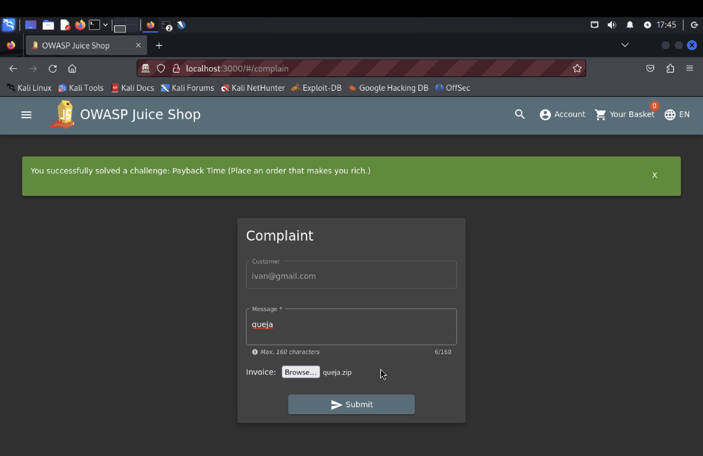
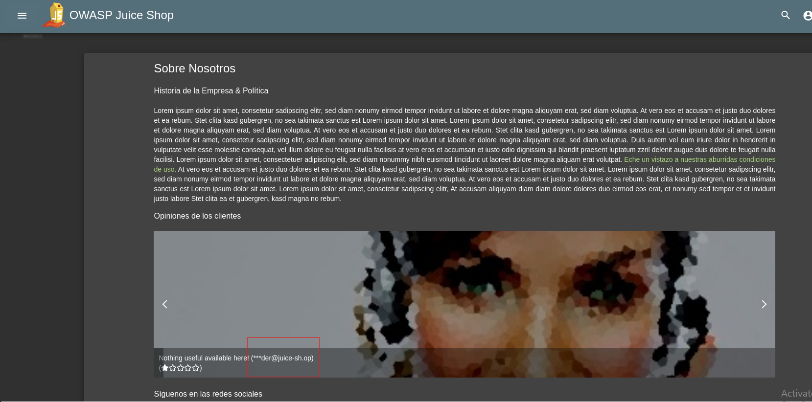

# Índice

- [Zero-Stars](#Zero-Stars)
- [Admin-Registration](#Admin-Registration)
- [Forged-Review](#Forged-Review)
- [Payback-Time](#Payback-Time)
- [Upload-Type](#Upload-Type)
- [Login-Admin](#Login-Admin)
- [Login-Bender](#Login-Bender)
- [View-Basket](#View-Basket)
- [Manipulate-Basket](#Manipulate-Basket)
- [Christmas-Special](#Christmas-Special)
 
# Introducción
OWASP Juice Shop es una aplicación web deliberadamente insegura. A continuación, se presentan 10 de las vulnerabilidades en la aplicación. 

# Zero Stars

__Descripción:__ Es posible dar una review con 0 estrellas a la tienda. Esto sucede debido a que del lado del servidor no se validan correctamente los datos que se obtienen del lado del cliente.  
__Clasificación:__  A04:2021 – Diseño Inseguro   
__Pasos:__  
1. Interceptar desde ZAP la solicitud enviada al dar una review a la tienda.

    

    

2. Modificar el valor _rating_ a 0.

    

3. Enviar la solicitud.

    

__Solución planteada:__  Verificar del lado del servidor el input que se recibe. Si solo se aceptan valores del 1 al 5 para las estrellas, se deberían rechazar solicitudes que incluyan valores fuera de ese rango.

# Admin Registration

__Descripción:__ Es posible registrarse como un usuario con privilegios de administrador. Sucede porque se permite modificar campos ocultos en la solicitud realizada al crear un usuario y otorgar privilegios de administrador.  
__Clasificación:__  A01:2021 – Pérdida de Control de Acceso    
__Pasos:__  
1. Registrarse desde la página e interceptar la petición desde ZAP.

    

    

2. En el cuerpo de la solicitud, añadir el campo _"role": "admin"_.

    

3. Al enviar la solicitud, en la respuesta se observa que el usuario ha sido creado con el rol de admin.

    

__Solución planteada:__  No permitir que el cliente envie información relacionada con los roles de los usuarios. La asignación de roles debe estar controlada por el backend. Al registrar un usuario, el servidor debe asignar automáticamente el rol correcto.

# Forged Review

__Descripción:__  Es posible manipular el autor de un comentario al interceptar la petición correspondiente y modificar los datos enviados desde el cliente. Esto ocurre porque el servidor no valida adecuadamente el campo "author", permitiendo que cualquier usuario altere el nombre del autor del comentario antes de enviarlo. Como resultado, un atacante puede crear comentarios con nombres falsos o suplantar la identidad de otros usuarios, lo que puede afectar la integridad de los datos mostrados.

__Clasificación:__  A01:2021 – Pérdida de Control de Acceso

__Pasos:__  
1. Abre OWASP Juice Shop y navega a un producto.
Escribe un comentario y captura la petición con OWASP ZAP antes de enviarla.

2. En la petición interceptada, modifica el campo "author" con un valor diferente, por ejemplo, "Forged Review", para falsificar el autor del comentario.

3. Envía la solicitud y observa que el comentario se publica con el autor modificado.

__Solución planteada:__  El cliente nunca debería poder enviar o modificar datos sensibles como el autor de un comentario. La asignación de esta información debe estar completamente gestionada en el backend, garantizando que el autor del comentario sea el usuario autenticado que realiza la acción. El servidor debe ignorar cualquier intento de modificar el campo "author" en las solicitudes del cliente, asignando automáticamente el autor correcto en función del usuario autenticado. Esta medida previene la manipulación de datos y asegura la integridad de los comentarios en el sistema.

# Payback Time
 
__Descripción:__  Es posible explotar una vulnerabilidad en el proceso de compra al interceptar la petición de añadir productos al carrito y modificar la cantidad a un número negativo. Esta falla permite que el precio total del pedido se vuelva negativo, lo que da lugar a pagos fraudulentos cuando el usuario finaliza la compra usando el saldo en la wallet. Esta vulnerabilidad se debe a la falta de validación adecuada en los valores enviados al backend.

__Clasificación:__  A01:2021 – Pérdida de Control de Acceso

__Pasos:__  
1. Navegar a OWASP Juice Shop y seleccionar un producto para añadir al carrito.
Utiliza una herramienta de interceptación como OWASP ZAP para capturar la petición de añadir el producto.

2. Edita el campo "quantity" en la petición para que sea un valor negativo, por ejemplo, -1.

3. Observa que el carrito ahora muestra una cantidad negativa de productos y un total negativo en el precio.

4. Procede al proceso de checkout y selecciona el método de pago con la wallet.
El sistema permite finalizar la compra con un saldo a favor debido al valor negativo en el total del pedido.

__Solución planteada:__  El cliente nunca debería poder enviar o modificar datos sensibles como la cantidad de productos en el carrito de compras. La validación y el control de estos valores deben estar completamente gestionados en el backend para garantizar que solo se acepten cantidades válidas y positivas. El servidor debe ignorar cualquier intento de enviar cantidades negativas o valores manipulados desde el cliente, asegurándose de procesar solo las solicitudes con datos válidos y seguros. Esta medida asegura la integridad del proceso de compra y previene manipulaciones fraudulentas que puedan afectar el saldo o el total de la transacción.

# Upload Type

__Descripción:__  Es posible interceptar la solicitud de subida de archivos al realizar una queja y manipular la extensión del archivo cargado para que no tenga una extensión válida como .pdf o .zip. Esta vulnerabilidad surge debido a la falta de validaciones estrictas en el backend sobre el tipo de archivo permitido, permitiendo que se suban archivos potencialmente peligrosos o no permitidos.

__Clasificación:__  A05:2021 – Configuración de Seguridad Incorrecta

__Pasos:__  
1. Navegar a la sección de quejas en OWASP Juice Shop.
Completar el formulario de queja, seleccionando un archivo con una extensión permitida (por ejemplo, .pdf o .zip).

2. Utiliza OWASP ZAP para interceptar la solicitud de subida del archivo al servidor.
Modifica el nombre del archivo, eliminando la extensión permitida (por ejemplo, cambiando archivo.pdf a archivo).

3. Envía la solicitud modificada sin la extensión adecuada y verifica que el archivo se sube exitosamente.

4. Después de enviar la solicitud, verifica que el sistema acepte el archivo sin la extensión permitida y que se resuelva el desafío de "Upload Type"

__Solución planteada:__  La solución implica validar en el backend tanto la extensión como el tipo MIME del archivo subido. Solo deben aceptarse archivos con extensiones permitidas como .pdf o .zip, y su contenido debe corresponder al tipo MIME. Si el archivo no cumple con estas reglas, el servidor debe rechazar la solicitud, evitando así la subida de archivos maliciosos o manipulados.

# Login Admin 
__Descripción:__  Existe una vulnerabilidad de inyección SQL en el sistema de inicio de sesión, ya que permite acceder como administrador sin conocer la contraseña, debido a que no se sanitizan correctamente los datos ingresados por el usuario.

__Clasificación:__  A03:2021 – Inyección 

__Pasos:__  
1. Acceder a la pantalla de iniciar sesión.

2. En el campo de "Email", ingresar la siguiente inyección sql:

    
   
Esta inyección funciona porque el operador OR true hace que la condición en la consulta SQL siempre sea verdadera. El uso del comentario (--) omite la validación de la contraseña que sigue a continuación.

4. En el campo de "Password" ingresar cualquier cosa.
   
5. Presionar el botón de Log in.
   
   
   
   
__Solución planteada:__  Para prevenir inyecciones SQL, es fundamental utilizar Prepared Statements. Los Prepared Statements parametrizan las consultas SQL, evitando que el input del usuario se integre directamente en la consulta SQL. De esta manera, cualquier dato ingresado se tratará como valor y no como código ejecutable.

# Login Bender 
__Descripción:__  Existe una vulnerabilidad de inyección SQL en el sistema de inicio de sesión, ya que permite acceder como Bender sin conocer su contraseña, debido a que no se sanitizan correctamente los datos ingresados por el usuario. Además se está exponiendo información sensible en la página, ya que el correo del mismo estaba visible públicamente.

__Clasificación:__  A03:2021 – Inyección  

__Pasos:__  
1. Acceder a la sección de About Us.
2. Revisar las opiniones de los clientes.
   

3. Copiar el mail del bender.
4. Acceder a la pantalla de inicio de sesión.
5. En el campo de "email", ingresar la siguiente inyección SQL con el correo de Bender:
   

Esta inyección funciona debido al uso del comentario SQL (--), que omite la validación de la contraseña y fuerza a la consulta a tratar el usuario como si hubiera sido autenticado correctamente.

6. En el campo de "password", ingresar cualquier valor, ya que no será validado por la inyección.

7. Hacer clic en "Iniciar sesión".

**Riesgo adicional:**
Además de la vulnerabilidad de inyección SQL, la exposición pública del correo electrónico de Bender constituye un riesgo de seguridad, ya que puede ser utilizado por atacantes para facilitar otros ataques, como phishing.

__Solución planteada:__

**Sanitización de las entradas:** Utilizar Prepared Statements para evitar la inyección SQL, ya que estos parametrizan las consultas, lo que impide que el input del usuario sea tratado como código ejecutable.

**Ocultar información sensible:** Evitar la exposición de correos electrónicos u otros datos personales de los usuarios en la interfaz pública.

# View Basket
__Descripción:__ Existe una vulnerabilidad de pérdida de control de acceso, en la vista del carrito, ya que se pueden ver carritos de otros usuarios.

__Clasificación:__  A01:2021 – Broken Access Control

__Pasos:__  
1. Ingresar a la pantalla del Basket.
2. Abrir las herramientas de desarrollador del navegador (F12).
3. Acceder al Session Storage.
   

4. Modificar el id del carrito (bid)
   

5. Visualizar el carrito de otro usuario.
   

__Solución planteada:__
Se debe realizar el control de acceso del lado del servidor, donde el atacante no puede modificarlo. El sistema debe verificar que el ID del carrito corresponde al usuario autenticado antes de permitir cualquier visualización o modificación.

# Manipulate Basket

__Descripción:__  Es posible añadir un item al carrito de otro usuario. Esto sucede porque no se verifica que el usuario que está logueado tenga los permisos necesarios para modificar el carrito que esta manipulando.  
__Clasificación:__  A01:2021 - Broken Access Control  
__Pasos:__  

1. Añadir un item al carrito e interceptar la petición.

2. Borrar el paramétro BasketId de la petición y enviar. 

3. Esto va a hacer que se genere un item de carrito, el cual tendrá un Id, pero no va a tener ningún BasketId asociado.

3. Añadir más items de un producto que ya tengamos en el carrito para analizar los endpoins que son invocados. En esta caso, ya se tenía el producto Apple juice en el carrito y se añadió de nuevo.

4. Vemos que se invoca un endpoint que permite consultar los items de carrito por Id.

5. Al utilizar este endpoint para consultar el Id del item de carrito generado en el paso 2, vemos que el paramétro BasketId es nulo debido a que no se añadió a ningún carrito.

6. Tambien vemos que se llama a un endpoint para modificar la cantidad del item en el carrito.

7. Modificamos la solicitud a este endpoint, indicando en la ruta el Id del item de carrito generado en el paso 2, y añadiendo el paramétro BasketId en el cuerpo de la solicitud indicando el BasketId de otro usuario.

8. Al loguearnos como otro usuario, vemos el item añadido al carrito.

__Solución planteada:__  Cada vez que se realice una acción sobre un basketId (ya sea al crear o modificar un ítem en el carrito), el servidor debe asegurarse de que el BasketId pertenece al usuario autenticado. 

También, se podría evitar que el cliente envíe el campo BasketId en el cuerpo de la solicitud para crear o modificar items del carrito, y que sea el servidor el que asigne el BasketId del usuario autenticado, evitando que el cliente lo pueda modificar.

# Christmas Special 

__Descripción:__ Existe una vulnerabilidad del tipo inyección, ya que ingresando una Inyección SQL ciega, se logra obtener la lista de todos los productos, incluidos los que deberían estar ocultos para el usuario. Y luego con el id del producto comprar un producto no disponible.
__Clasificación:__ A03:2021 – Inyección 

__Pasos:__ 
1. Interceptar las solicitudes con ZAP.
2. Acceder a la página de búsqueda dentro de Orange Juice:
  *http://localhost:3000/#/search*
3. Dentro de las solicitudes, reconocer la solicitud GET *http://localhost:3000/rest/products/search?q=*, que devuelve la lista de los productos.

      
   
4. Probar de generar una inyección, el primer intento es ingresar en el parámetro q: --> **';**
   Enviar a través de la solicitud:
      GET *http://localhost:3000/rest/products/search?q='*
   
     
   
     

5. Recibirá el error: SQLITE_ERROR: syntax error. Lo que indica que la inyección SQL es realmente posible.
   
    
   
6. Probar de generar una inyección, el segundo intento es ingresar en el parámetro q: --> **'--**
   
   
   
7. Recibirá el error: SQLITE_ERROR: incomplete input
   
    
   
8. Generar una inyección, el último intento es ingresar en el parámetro q: --> **'))--**
   
    

   
   
    
   
   Con esto se logra obtener la lista completa de los productos y obtener el id de la oferta navideña.
   
9. Ir a la página de inicio de login e inicie sesión como cualquier usuario.

10. Agregar un producto al carrito.

11. Dentro de las solicitudes, reconocer la solicitud GET *http://localhost:3000/api/BasketItems*. 
    

12. Modificar el  ProductId a 10 y presionar Send.

13. Pagar para resolver el desafío.

__Solución planteada:__

Para mitigar la vulnerabilidad de inyección SQL y prevenir la manipulación de productos no disponibles, se deben aplicar las siguientes medidas:

**Utilización de Prepared Statements:**
La consulta SQL debe utilizar Prepared Statements para evitar que el input del usuario se interprete como parte de la consulta SQL. Al parametrizar las consultas, el sistema trata los datos ingresados como valores, no como código ejecutable.

**Validación y sanitización de entradas:**
Validar y sanitizar todos los inputs provenientes del usuario, asegurándose de que cualquier parámetro en las solicitudes (como el parámetro q en la búsqueda de productos) esté limpio y no permita inyecciones.

**Restricciones en el lado del servidor para la manipulación de IDs de productos:**
El servidor debe validar si el producto que se está añadiendo al carrito es realmente elegible para el usuario y si está disponible en el inventario. No se debe confiar en los datos enviados desde el cliente. Para agregar una capa adicional de seguridad, se recomienda aplicar firma de tokens o validación del lado del servidor de los IDs de productos, de modo que la manipulación de datos en las solicitudes del cliente sea detectada y bloqueada.
