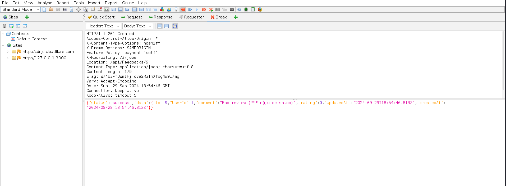

# Introducción
OWASP Juice Shop es una aplicación web deliberadamente insegura. A continuación, se presentan 10 de las vulnerabilidades en la aplicación. 

# Zero Stars

__Descripción:__ Es posible dar una review con 0 estrellas a la tienda. Esto sucede debido a que del lado del servidor no se validan correctamente los datos que se obtienen del lado del cliente.  
__Clasificación:__  A04:2021 – Diseño Inseguro   
__Pasos:__  
1. Interceptar desde ZAP la solicitud enviada al dar una review a la tienda.

    

    

2. Modificar el valor _rating_ a 0.

    

3. Enviar la solicitud.

    

__Solución planteada:__  Verificar del lado del servidor el input que se recibe. Si solo se aceptan valores del 1 al 5 para las estrellas, se deberían rechazar solicitudes que incluyan valores fuera de ese rango.

# Admin Registration

__Descripción:__ Es posible registrarse como un usuario con privilegios de administrador. Sucede porque se permite modificar campos ocultos en la solicitud realizada al crear un usuario y otorgar privilegios de administrador.  
__Clasificación:__  A01:2021 – Pérdida de Control de Acceso    
__Pasos:__  
1. Registrarse desde la página e interceptar la petición desde ZAP.

    

    

2. En el cuerpo de la solicitud, añadir el campo _"role": "admin"_.

    

3. Al enviar la solicitud, en la respuesta se observa que el usuario ha sido creado con el rol de admin.

    

__Solución planteada:__  

# Forged Review - Javier

Interceptar peticion al realizar comentario y cambiar autor

# Payback Time - Javier

Interceptar peticion al añadir al carrito y añadir cantidad negativa, luego pagar con wallet

# Upload Type - Javier

Interceptar peticion al subir una queja y borrar el .pdf de la solicitud

# Login Admin 
__Descripción:__  Existe una vulnerabilidad de inyección SQL en el sistema de inicio de sesión, ya que permite acceder como administrador sin conocer la contraseña, debido a que no se sanitizan correctamente los datos ingresados por el usuario.

__Clasificación:__  A03:2021 – Inyección 

__Pasos:__  
1. Acceder a la pantalla de iniciar sesión.

2. En el campo de "Email", ingresar la siguiente inyección sql:

    
   
Esta inyección funciona porque el operador OR true hace que la condición en la consulta SQL siempre sea verdadera. El uso del comentario (--) omite la validación de la contraseña que sigue a continuación.

4. En el campo de "Password" ingresar cualquier cosa.
   
5. Presionar el botón de Log in.
   
   
   
   
__Solución planteada:__  Para prevenir inyecciones SQL, es fundamental utilizar Prepared Statements. Los Prepared Statements parametrizan las consultas SQL, evitando que el input del usuario se integre directamente en la consulta SQL. De esta manera, cualquier dato ingresado se tratará como valor y no como código ejecutable.

# Login Bender 
__Descripción:__  Existe una vulnerabilidad de inyección SQL en el sistema de inicio de sesión, ya que permite acceder como Bender sin conocer su contraseña, debido a que no se sanitizan correctamente los datos ingresados por el usuario. Además se está exponiendo información sensible en la página, ya que el correo del mismo estaba visible públicamente.

__Clasificación:__  A03:2021 – Inyección 
Acceder a la pantalla de inicio de sesión.

__Pasos:__  
1. Acceder a la sección de About Us.
2. Revisar las opiniones de los clientes.
   

3. Copiar el mail del bender.
4. Acceder a la pantalla de inicio de sesión.
5. En el campo de "email", ingresar la siguiente inyección SQL con el correo de Bender:
   

Esta inyección funciona debido al uso del comentario SQL (--), que omite la validación de la contraseña y fuerza a la consulta a tratar el usuario como si hubiera sido autenticado correctamente.

6. En el campo de "password", ingresar cualquier valor, ya que no será validado por la inyección.

7. Hacer clic en "Iniciar sesión".

**Riesgo adicional:**
Además de la vulnerabilidad de inyección SQL, la exposición pública del correo electrónico de Bender constituye un riesgo de seguridad, ya que puede ser utilizado por atacantes para facilitar otros ataques, como phishing.

__Solución planteada:__

**Sanitización de las entradas:** Utilizar Prepared Statements para evitar la inyección SQL, ya que estos parametrizan las consultas, lo que impide que el input del usuario sea tratado como código ejecutable.

**Ocultar información sensible:** Evitar la exposición de correos electrónicos u otros datos personales de los usuarios en la interfaz pública.

# View Basket 
__Descripción:__ Existe una vulnerabilidad de pérdida de control de acceso, en la vista del carrito, ya que se pueden ver carritos de otros usuarios.

__Clasificación:__  A01:2021 – Broken Access Control

__Pasos:__  
1. Ingresar a la pantalla del Basket.
2. Abrir las herramientas de desarrollador del navegador (F12).
3. Acceder al Session Storage.
   

4. Modificar el id del carrito (bid)
   

5. Visualizar el carrito de otro usuario.
   

__Solución planteada:__
Se debe realizar el control de acceso del lado del servidor, donde el atacante no puede modificarlo. El sistema debe verificar que el ID del carrito corresponde al usuario autenticado antes de permitir cualquier visualización o modificación.

# Manipulate Basket - Javier

Añadir item a carrito sin basketId, se va a generar objeto de item añadido con id pero no esta asociado a ningun carrito, realizar put request y añadir a carrito de otra persona

# Christmas Special 

__Descripción:__ Existe una vulnerabilidad del tipo inyección, que permite obtener la lista de todos los productos, incluidos los que deberían estar ocultos para el usuario. Y luego con el id del producto comprar un producto no disponible.
__Clasificación:__ A03:2021 – Inyección 

__Pasos:__ 
1. Interceptar las solicitudes con ZAP.
2. Acceder a la página de búsqueda dentro de Orange Juice:
  *http://localhost:3000/#/search*
3. Dentro de las solicitudes, reconocer la solicitud GET *http://localhost:3000/rest/products/search?q=*, que devuelve la lista de los productos.

      
   
4. Probar de generar una inyección, el primer intento es ingresar en el parámetro q: --> **';**
   Enviar a través de la solicitud:
      GET *http://localhost:3000/rest/products/search?q='*
   
     
   
     

5. Recibirá el error: SQLITE_ERROR: syntax error. Lo que indica que la inyección SQL es realmente posible.
   
    
   
6. Probar de generar una inyección, el segundo intento es ingresar en el parámetro q: --> **'--**
   
   
   
7. Recibirá el error: SQLITE_ERROR: incomplete input
   
    
   
8. Generar una inyección, el último intento es ingresar en el parámetro q: --> **'))--**
   
    

   
   
    
   
   Con esto se logra obtener la lista completa de los productos y obtener el id de la oferta navideña.
   
9. Ir a la página de inicio de login e inicie sesión como cualquier usuario.

10. Agregar un producto al carrito.

11. Dentro de las solicitudes, reconocer la solicitud GET *http://localhost:3000/api/BasketItems*. 
    

12. Modificar el  ProductId a 10 y presionar Send.

13. Pagar para resolver el desafío.

__Solución planteada:__

